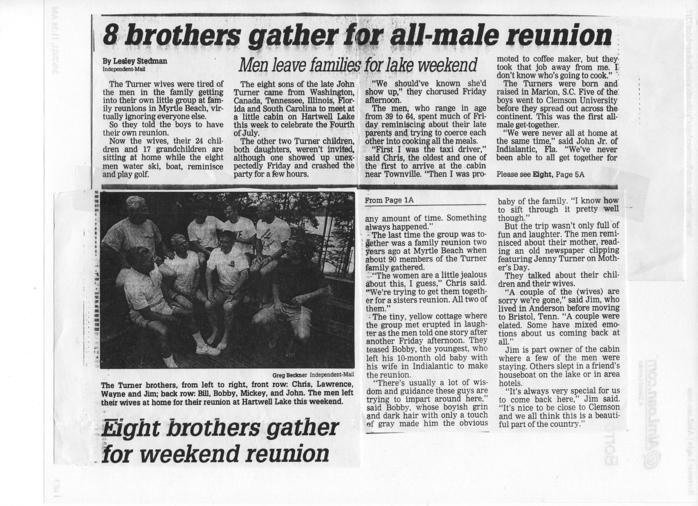

--- 
title: "2022 Turner Reunion"
author: "The Jim & Dianne Turner Clan"
date: "`r Sys.Date()`"
site: bookdown::bookdown_site
documentclass: book
# url: your book url like https://bookdown.org/yihui/bookdown
# cover-image: path to the social sharing image like images/cover.jpg
description: |
  Headquarters for all info about the 2022 Turner Reunion
biblio-style: apalike
csl: chicago-fullnote-bibliography.csl
---

# 2022 Turner Reunion Headquarters  {-}

::: {.rmdimportant}

This website serves as schedule headquarters for the **2022 Turner Reunion**. 

:::

## Hotel Link and Details  {-}

> **[Turner Reunion Hotel Link HERE!](https://www.marriott.com/events/start.mi?id=1628261049761&key=GRP)**

Turner Family Reunion

- Hotel Block Start Date: Monday, June 27, 2022
- Hotel Block End Date: Wednesday, July 6, 2022
- Last Day to Book: Friday, June 10, 2022
- Hotel(s) offering your special group rate:
- Greenville Marriott for 99 USD per night, includes breakfast

::: {.rmdimportant}

**[Turner Reunion Hotel Link HERE!](https://www.marriott.com/events/start.mi?id=1628261049761&key=GRP)**

:::

## Schedule  {-}

**Reunion Headquarters: Hospitality Room at the Hotel**

- We have full-time use of a hospitality room at the hotel for all three days -- this will be the place to meet, mingle, catch up, share photos and family updates, and make plans!!!  This is official **Reunion Headquarters**
- This is a private, air conditioned room right off the pool with private restrooms and direct access and views of the pool  -- the room is **AWESOME**

**Thursday, June 30, 2022**

- LEISURELY Breakfast at the hotel
- **PLAY, PLAY, PLAY** at the hotel pool (it is wonderful)
- Optional **on-your-own** day trips for hikes to mountaintops or waterfalls, Greenville Zoo and playground, or tours of Falls Park, or downtown Greenville
- Optional group dinner at **Silver Bay** at 6 pm at 916 NE Main St., Simpsonville, SC 29681 (pay your own way). 864-228-9705.  **A headcount poll will go out via GroupMe.**

We will need to get a headcount for dinner.  Then we will reserve a meeting room at  **Silver Bay** at 6 pm at 916 NE Main St., Simpsonville, SC 29681 (pay your own way). 864-228-9705.

**Friday, July 1, 2022** 

- LEISURELY Breakfast at the hotel
- Lake day on Lake Hartwell 10 AM to 4 PM (Fun fact: you have the chance to sit where the photo below was taken!)  **A headcount poll will go out via GroupMe.**
- Lake House address:  1120 Pine Lake Drive, Townville SC 29689
- Gentle Warning: Amenities at the lake house are **rustic chic**
- Dinner on your own 

We have several kid and adult size lifejackets to share, **but if you have access to lifejackets, please bring them.** We would like for everyone to wear them. **The lake will be very, very busy this weekend** – the busiest of the year. Also, don't wear a really nice bathing suit, as all the boats on the lake will kick up mud and give a nice permanent orange tint to whatever you wear!

We will also have hotdogs, watermelon and chips for lunch at the lake.

There is not a planned dinner for this evening.  We imagine people will be straggling back from the lake and other daily activities at random times. Some may even be tired!  I am sure there will be people hanging out at the hotel pool for those inclined.


**Saturday, July 2, 2022**

- LEISURELY Breakfast at the hotel
- Official Turner reunion 10 AM until noon at Hotel **A headcount poll will go out via GroupMe.**
- Lunch at Hotel noon until 1:30 PM
- Pool time at hotel 1:30 until ....

More details will follow on the actual reunion day activities.  We will definitely incorporate some of the standards you expect.

Please be thinking about who in your family would like to give an extended family update.  We would like to have one speaker represent the families of Chris, John, Lawrence, Jenny, Mickey, Bill, Yvonne, Jim, Wayne, and Bobby.

The **mandatory** family photo session will be in full effect!

There will also be a little bit of music, a game or two, and lots of eating!

After the official reunion, our hope is that everyone hangs out at the pool and/or the air-conditioned meeting rooms for most of the rest of the day.

## Neat Parting Memory  {-}

```{r, echo=FALSE, , out.width = '100%'}

```
